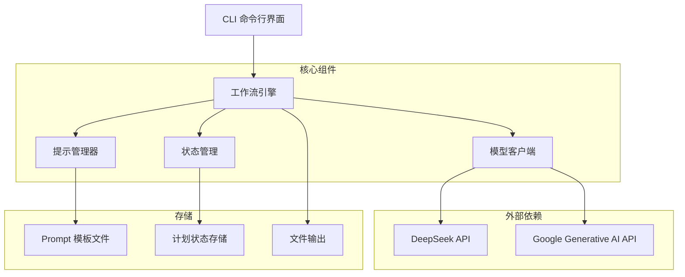
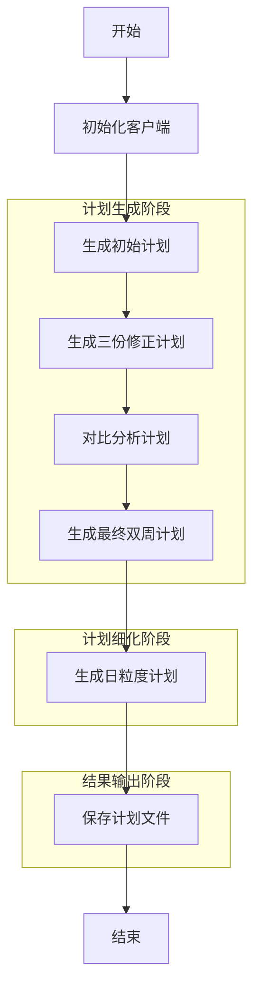
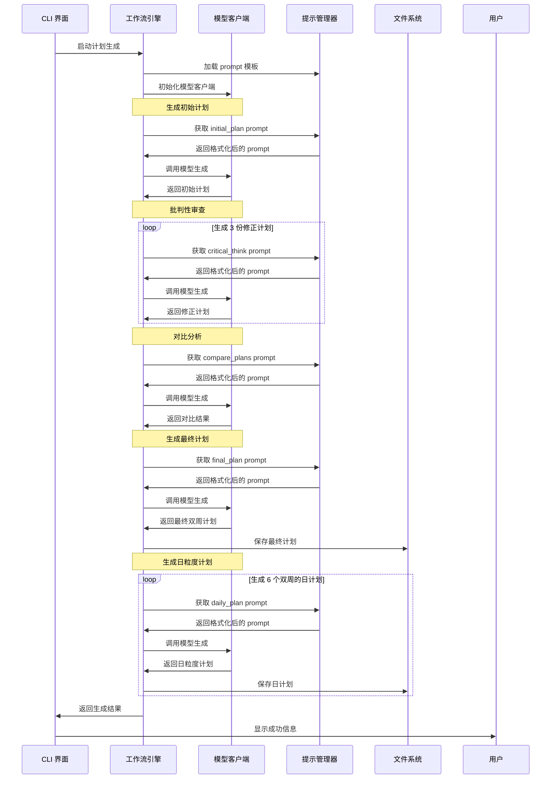

# LLM 学习计划生成器技术设计文档

## 1. 项目概述

LLM 学习计划生成器是一个基于大语言模型的个性化学习计划生成工具，能够根据用户的技术背景和学习目标，生成符合 SMART 原则的双周粒度学习计划，并进一步细化为日粒度学习安排。

### 1.1 核心功能

- 根据用户背景和目标生成初始学习计划
- 对初始计划进行批判性审查，生成多个修正方案
- 对比分析多个方案，生成最终双周计划
- 基于最终计划生成详细的日粒度学习安排
- 支持多种大模型平台（DeepSeek、Google Generative AI）
- 命令行交互界面
- 结构化日志记录

## 2. 系统架构



### 2.1 架构说明

- **CLI 命令行界面**：用户交互入口，接收用户输入参数，调用工作流引擎
- **工作流引擎**：基于 LangGraph 构建，管理整个计划生成流程
- **模型客户端**：封装不同大模型平台的 API 调用，提供统一的生成接口
- **提示管理器**：加载和管理 prompt 模板，支持动态参数替换
- **状态管理**：使用 Pydantic 模型管理工作流状态，确保数据一致性
- **文件输出**：将生成的计划保存为 Markdown 和 JSON 格式

## 3. 核心组件设计

### 3.1 工作流引擎

工作流引擎是系统的核心，基于 LangGraph 构建，定义了计划生成的完整流程。

```python
# 工作流节点定义
workflow = StateGraph(PlanState)
workflow.add_node("init_clients", init_clients)
workflow.add_node("generate_initial_plan", generate_initial_plan)
workflow.add_node("critique_plan", critique_plan)
workflow.add_node("compare_plans", compare_plans)
workflow.add_node("generate_final_plan", generate_final_plan)
workflow.add_node("generate_daily_plans", generate_daily_plans)
workflow.add_node("save_plans", save_plans)
```

### 3.2 模型客户端

模型客户端封装了不同大模型平台的 API 调用，提供统一的生成接口。

| 平台 | 模型 | API 密钥 |
|------|------|----------|
| DeepSeek | deepseek-chat | 环境变量配置 |
| Google Generative AI | 多种模型支持 | 环境变量配置 |

### 3.3 提示管理器

提示管理器负责加载和管理 prompt 模板，支持动态参数替换。模板文件存放在 `prompts` 目录下，采用 Markdown 格式。

### 3.4 状态管理

使用 Pydantic 模型管理工作流状态，确保数据一致性和类型安全。

```python
class PlanState(BaseModel):
    # 输入数据
    user_background: str
    user_goal: str
    original_question: str
    
    # 生成的计划
    initial_plan: str = ""
    revised_plans: List[str] = []
    comparison_result: str = ""
    final_plan: str = ""
    daily_plans: Dict[str, str] = {}
    
    # 配置
    output_dir: str = settings.output_dir
    
    # 客户端和管理器
    model_client: ModelClient = None
    prompt_manager: PromptManager = None
```

## 4. 核心流程图

### 4.1 计划生成主流程



### 4.2 计划生成详细流程



## 5. 数据模型

### 5.1 输入数据

| 字段名 | 类型 | 描述 |
|--------|------|------|
| user_background | str | 用户的技术背景介绍 |
| user_goal | str | 用户的学习目标 |
| original_question | str | 构建的原始问题，包含背景、目标和要求 |

### 5.2 输出数据

#### 5.2.1 双周计划（JSON 格式）

```json
{
  "title": "学习计划标题",
  "overview": "计划概述",
  "duration": "12周",
  "final_goal": "最终目标",
  "success_criteria": ["成功标准1", "成功标准2"],
  "risk_notes": "风险提示",
  "milestones": [
    {
      "week_range": "Week 1-2",
      "goal": "双周目标",
      "skills": ["技能1", "技能2"],
      "projects": ["项目1", "项目2"],
      "resources": ["资源1", "资源2"]
    }
  ]
}
```

#### 5.2.2 日粒度计划（JSON 格式）

```json
{
  "week_range": "Week 1-2",
  "total_hours": 40,
  "daily_schedule": [
    {
      "day": "周一",
      "date": "2024-01-01",
      "total_hours": 6,
      "rest_time": "休息安排",
      "learning_tips": "学习建议",
      "tasks": [
        {
          "title": "任务标题",
          "duration_hours": 2,
          "description": "任务描述",
          "skills": ["技能1"],
          "expected_outcome": "预期成果"
        }
      ]
    }
  ],
  "week_summary": "双周总结"
}
```

## 6. 技术栈

| 类别 | 技术/框架 | 版本 | 用途 |
|------|-----------|------|------|
| 编程语言 | Python | 3.8+ | 核心开发语言 |
| 工作流引擎 | LangGraph | 最新 | 构建状态管理工作流 |
| 大模型集成 | LangChain | 最新 | 封装大模型 API 调用 |
| 配置管理 | Pydantic Settings | 最新 | 环境变量配置管理 |
| 命令行界面 | Typer | 最新 | 构建命令行交互 |
| 日志管理 | Python logging | 内置 | 结构化日志记录 |
| 数据验证 | Pydantic | 最新 | 数据模型定义和验证 |

## 7. 目录结构

```
llm-as-learning-planer/
├── src/                     # 源代码目录
│   ├── __init__.py          # 包初始化文件
│   ├── cli.py               # 命令行界面
│   ├── config.py            # 配置管理
│   ├── model_client.py      # 模型客户端
│   ├── prompt_manager.py    # 提示管理器
│   └── workflow.py          # 工作流定义
├── prompts/                 # Prompt 模板目录
│   ├── initial_plan.md      # 初始计划模板
│   ├── critical_think.md    # 批判性审查模板
│   ├── compare_plans.md     # 计划对比模板
│   ├── final_plan.md        # 最终计划模板
│   └── daily_plan.md        # 日计划模板
├── docs/                    # 文档目录
│   └── technical-design.md  # 技术设计文档
├── logs/                    # 日志输出目录
├── plans/                   # 计划输出目录
├── .env                     # 环境变量配置
├── .env.example             # 环境变量示例
├── background.txt           # 背景示例文件
├── goal.txt                 # 目标示例文件
└── pyproject.toml           # 项目配置
```

## 8. 配置说明

### 8.1 环境变量配置

| 变量名 | 类型 | 默认值 | 描述 |
|--------|------|--------|------|
| PLATFORM | str | deepseek | 大模型平台（deepseek/google） |
| MODEL_NAME | str | deepseek-chat | 模型名称 |
| API_KEY | str | 必填 | 大模型 API 密钥 |
| LOG_LEVEL | str | INFO | 日志级别 |
| LOG_DIR | str | logs | 日志目录 |
| LOG_TO_FILE | bool | True | 是否输出日志到文件 |
| OUTPUT_DIR | str | plans | 计划输出目录 |

## 9. 扩展性设计

### 9.1 支持新的大模型平台

通过扩展 `ModelClient` 类，可以轻松集成新的大模型平台：

1. 在 `model_client.py` 中添加新平台的初始化逻辑
2. 实现统一的 `generate` 方法接口
3. 在配置中添加新平台支持

### 9.2 扩展计划生成流程

基于 LangGraph 的工作流设计，支持动态添加或修改流程节点：

1. 在 `workflow.py` 中定义新的流程节点函数
2. 将节点添加到工作流图中
3. 定义节点间的连接关系

### 9.3 自定义 Prompt 模板

支持通过修改 `prompts` 目录下的模板文件，自定义计划生成的提示内容，无需修改代码。

## 10. 性能与可靠性

### 10.1 错误处理机制

- 全面的异常捕获和日志记录
- 详细的错误信息输出
- 支持断点续传（通过状态持久化）

### 10.2 日志记录

- 分级日志记录（DEBUG/INFO/WARNING/ERROR）
- 支持控制台和文件双重日志输出
- 模型交互的完整记录
- 按时间戳命名的日志文件

### 10.3 资源管理

- 合理的 API 调用频率控制
- 内存使用优化
- 文件系统资源管理

## 11. 部署与使用

### 11.1 安装依赖

```bash
pip install -e .
```

### 11.2 配置环境变量

复制 `.env.example` 为 `.env`，并填写 API 密钥等配置。

### 11.3 运行命令

```bash
planer generate --background-file background.txt --goal-file goal.txt --output-dir plans
```

## 12. 未来规划

1. 支持 Web 界面
2. 集成更多大模型平台
3. 支持计划的可视化展示
4. 添加计划执行跟踪功能
5. 支持多人协作编辑计划
6. 集成学习资源推荐功能

## 13. 结论

LLM 学习计划生成器采用模块化设计，基于 LangGraph 构建的工作流引擎确保了流程的可扩展性和可维护性。通过封装不同大模型平台的 API，实现了平台无关性，同时结构化的日志记录和错误处理机制提高了系统的可靠性。

该设计支持快速扩展新功能和集成新的大模型平台，为用户提供个性化、高质量的学习计划生成服务。